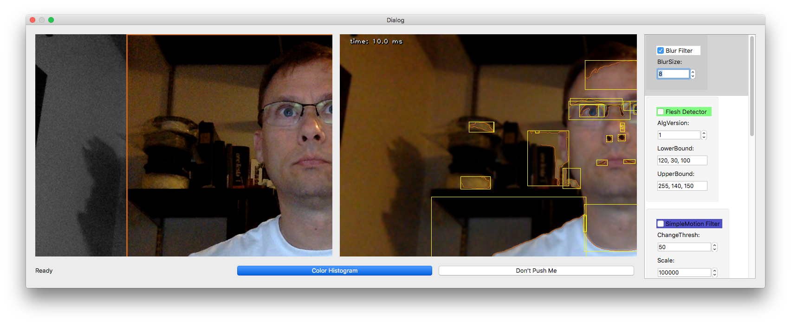
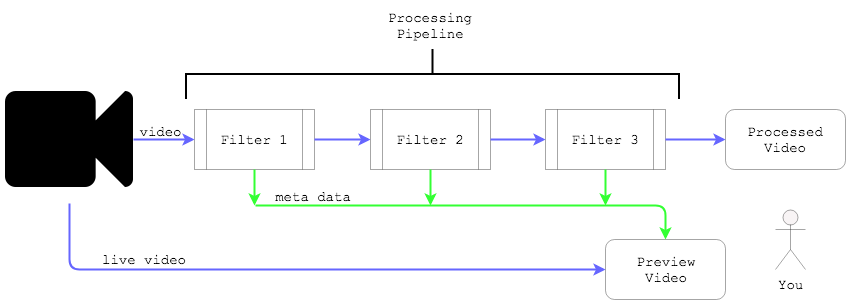
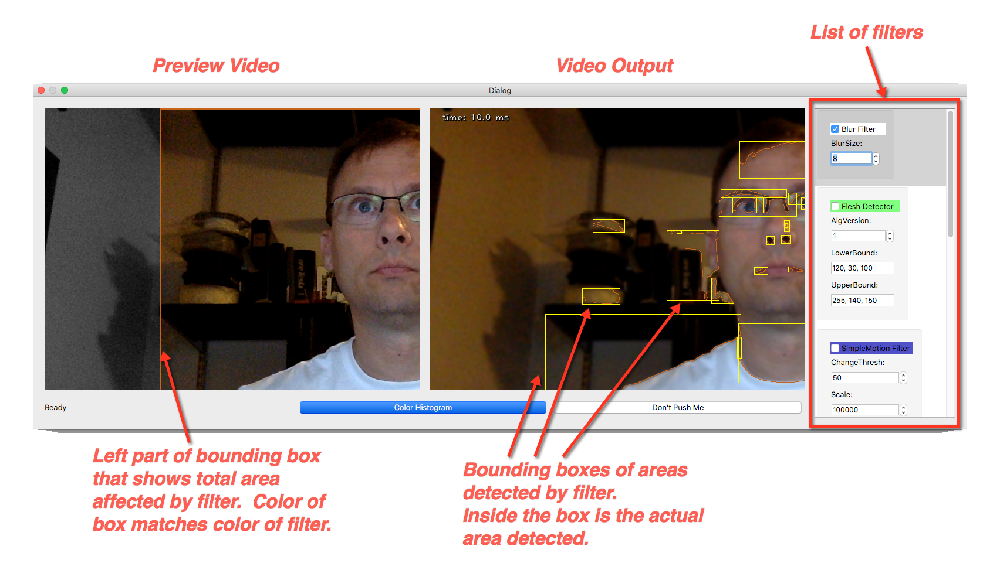

# vidpipe

Video data processing pipeline using OpenCV

A video processing toolset that allows the user to interactively modify the data in the video stream to
see the immediate effect.

## To run

python3 main.py

## Overview

The processing flow is a pipeline that uses filters to transform the data in discrete steps along the dataflow path.

A *filter* is an object made from a simple python file that that has processing functions called from the main app.  The main processing function is passed a single video frame data buffer.  That data can be examined and/or modified.  The new data can then be passed back to the main app.  (See [SampleFilter.py](https://github.com/jchrisweaver/vidpipe/blob/master/vidpipe/SampleFilter.py) for a simple example.)

Filters are arranged and called in a specific order to create a data flow.  The order of the filters matches the order in which they appear in the right-hand side of the dialog box in the scroll window.  Each filter can enabled or disabled.  The order of the filters can be changed by dragging and dropping the filter into a differnt position in the processing order.  Each filters effects can be immediately visible in the processed video feed and compared to the preview video feed.

Settings for each individual filter can be changed in the dialog box for the filter.  Changes take effect immediately.

Each filter takes a single action.  For example, the Blur Filter takes an incoming video frame, applies a blur action to the frame data and then passes the new frame data to the next filter in the path.

## The Currently Implemented Filters

* Blur filter - uses OpenCV [GaussianBlur](https://docs.opencv.org/2.4/modules/imgproc/doc/filtering.html?highlight=gaussianblur#gaussianblur) function
* Simple motion detector
* Edge detector - uses OpenCV [Canny](https://docs.opencv.org/2.4/modules/imgproc/doc/feature_detection.html?highlight=canny#canny) and [findCountours](https://docs.opencv.org/2.4/modules/imgproc/doc/structural_analysis_and_shape_descriptors.html?highlight=findcontoures#findcontours) functions
* Activity detector

## Steps to Create New filters

*TODO: Add steps here!*

The GUI is designed with QT for simplicity, which must be installed manually (https://www.qt.io/download)

## Future Filters

* Color filter - pick out a specific color in the video
* YOLO - implement the YOLO algorithm
* Object track - track objects on linear path

## Why I Wrote This

I took the [PyImageSearch Gurus](https://www.pyimagesearch.com/pyimagesearch-gurus/) course to learn more about computer vision.  Many of
the steps required to process an image have several discrete stages of manipulation or analyis of the image data to arrive at a result.

I wanted to better understand how each discrete step affected the image data and how rearranging the order of each step affected the data.  This tool made it extremelty easy to visualize each step.  I've continued to add additional fun filters as time and interest permit.

If you use and enjoy this tool, please let me know @jchrisweaver on twitter.

And by all means, please submit PRs if you'd like to add features, fix bugs, etc.

## NOTE:  Selecting the camera for the video feed

The camera feed is selected in the KnobTurner class in the main.py file as _cameraId.  For OS X, it's unclear how the camera ID is determined.  I've found it to be 0 on my Mac, but it may not be the same on other systems.

Further, OS X has implemented an enhanced permissions model that requires the user to give the app permission to use the camera.  I don't have more information at this point on how to work with that model, other than to give the app permission when requested.
